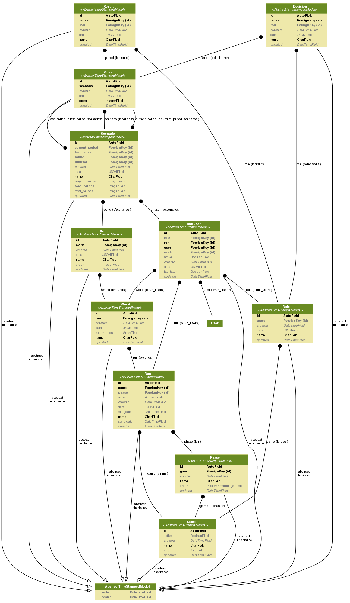

# SIMPL-GAMES-API

SIMPL Games Framework API

## Getting Started

Make sure you are working in a virtual environment of some sort (e.g. 'virtualenv').

If you are working in Vagrant you are working in Vagrant using virtualenv, add simpl-games-api to the code path:

```bash
$ add2virtualenv /vagrant/html/simpl-games-api
```
If you are working in Vagrant:

```bash
$ cd /vagrant/html/simpl-games-api
```

Create a database (defaults to Postgres):

```bash
$ createdb simpl
```

Install requirements:

```bash
$ pip install -r requirements.txt
```

Setup your `DJANGO_SETTINGS_MODULE` to use:

```bash
$ export DJANGO_SETTINGS_MODULE=config.settings.local
```

Sync models to database:

```bash
$ ./manage.py migrate
```

Create a superuser account to access the admin:

```bash
$ ./manage.py createsuperuser
```

Start the web server:

```bash
$ ./manage.py collectstatic
$ ./manage.py runserver 0.0.0.0:8000
```

### Running tests with py.test

Change into the `simpl` subdirectory:

```bash
$ cd simpl
```

If you are working in Vagrant, this will be something like:

```bash
$ cd /vagrant/html/simpl-games-api/simpl
```

```bash
$ py.test
```

## What's where?

- [API Docs](http://localhost:8000/docs/)
- The [SIMPL api](http://localhost:8000/apis/)
- [SIMPL Frontend Admin](http://localhost:8000/simpl/)
- [Django Admin](http://localhost:8000/admin/) but only if you need it!

## Model Schema


